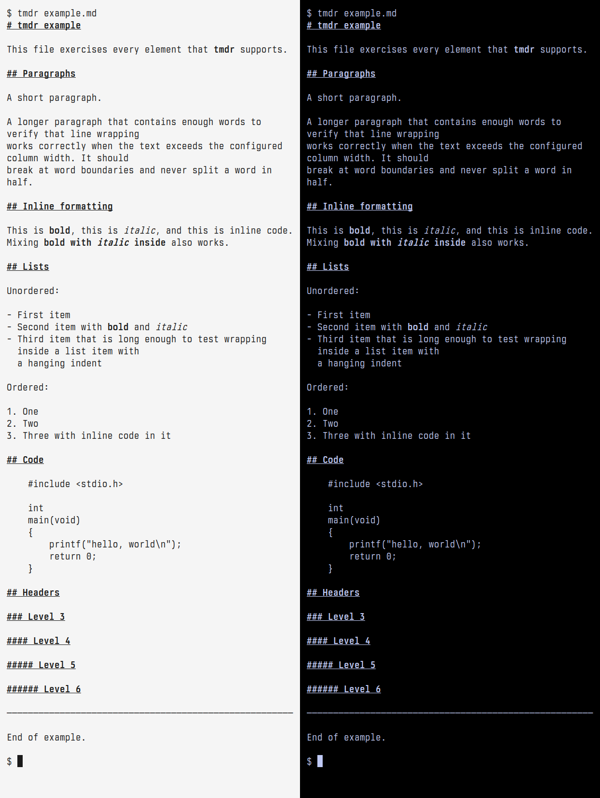

tmdr - Tiny Markdown Reader
==================================
tmdr is a tiny markdown terminal reader written in Rust.
It renders headings, paragraphs, lists, code blocks, bold,
italic, inline code, links (OSC 8), and GFM tables directly
in the terminal.

Requirements
------------
In order to build tmdr you need rustc.

Installation
------------
Edit Makefile to match your local setup (tmdr is installed into
the /usr/local/bin namespace by default).

Afterwards enter the following command to build and install tmdr:

    make clean install

To fetch vendored dependencies from crates.io:

    make vendor

Running tmdr
------------
Render a file:

    tmdr README.md

Pipe from standard input:

    curl -s https://example.com/file.md | tmdr

Set column width to 60:

    tmdr -w 60 README.md

Download
--------
    got clone ssh://anon@ijanc.org/tmdr
    git clone https://git.ijanc.org/tmdr.git
    git clone https://git.sr.ht/~ijanc/tmdr
    git clone https://github.com/ijanc/tmdr.git

License
-------
ISC — see LICENSE.
